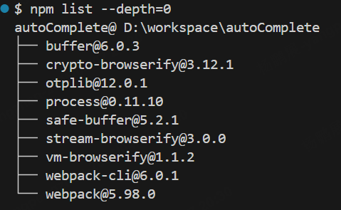

# AutoComplete

AutoComplete 是一个 Chrome 浏览器插件，用于自动填充某桌面的用户名、密码和 2FA 验证码，并自动点击登录按钮。

## Windows 下使用方法

- 打开项目目录中的 `manifest.json` 文件，找到以下代码片段：

    ```json
    "host_permissions": [""],
    "content_scripts": [
        {
        "matches": [""],
        "js": ["dist/content.bundle.js"],
        "run_at": "document_end"
        }
    ],
    ```

- 修改 `host_permissions` 和 `content_scripts.matches` 的值为某桌面的 [URL](https://en.wikipedia.org/wiki/URL)。
- 打开项目目录中的 `content.js` 文件，找到以下代码片段：

   ```js
   // 设置你的 2FA secret key
   const secretKey = ''; // 替换为你的实际 secret key

   function autoFillInputs() {
     // 自动填充用户名输入框
     const usernameInput = document.getElementById('Enter user name');
     if (usernameInput) {
       usernameInput.value = ''; // 替换为实际的用户名
     }

     // 自动填充密码输入框
     const passwordInput = document.getElementById('passwd');
     if (passwordInput) {
       passwordInput.value = ''; // 替换为实际的密码
     }
   }
   ```

- 修改以下内容为你的实际信息并保存
    - `secretKey`：替换为你的 2FA 密钥。
    - `usernameInput.value`：替换为你的用户名。
    - `passwordInput.value`：替换为你的密码。
- 重新打包项目
    - 确保你已经安装了 [NVM for Windows](https://github.com/coreybutler/nvm-windows) 和 [Node.js](https://nodejs.org/en)，`Node.js` 版本为 `v22.14.0`。
    - 使用 [npm](https://www.npmjs.com/) 在本地自行安装以下依赖，安装方法请自行研究。
        
    - 使用 `npx webpack` 打包项目。
- 打包完成后，生成的文件会位于 `dist` 文件夹中。

### 在 Chrome 中加载插件

- 打开 Chrome 浏览器，进入扩展程序管理页面：
    - 地址栏输入 `chrome://extensions/` 并回车。
- 打开右上角的 *Developer mode*。
- 点击 *Load unpacked*。
- 选择该项目。
- 加载完成后，插件会出现在扩展程序列表中。

## 注意

- 此项目仅测试了 [Happy path](https://en.wikipedia.org/wiki/Happy_path)，如有任何疑问请自行研究。
- 使用前请仔细阅读使用说明，使用不当由此造成的任何损失与本人无关。
